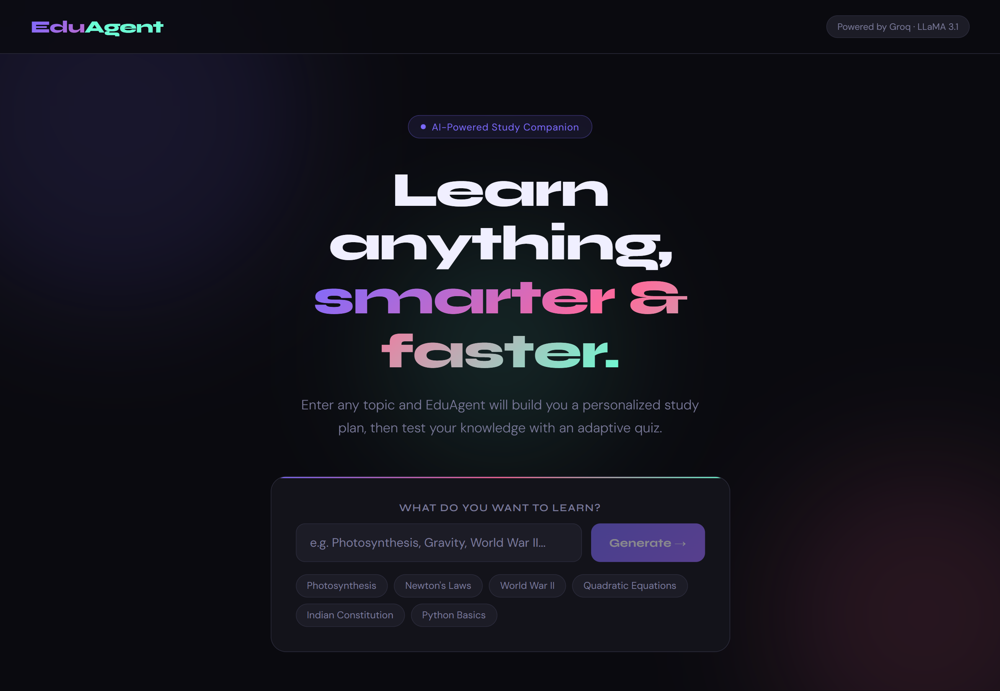
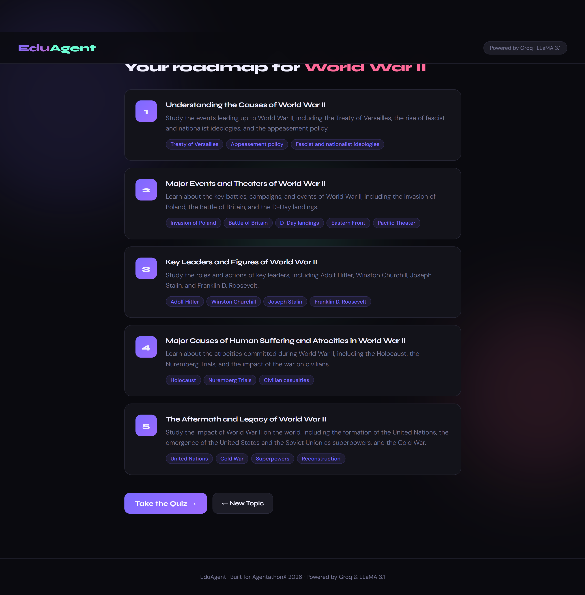
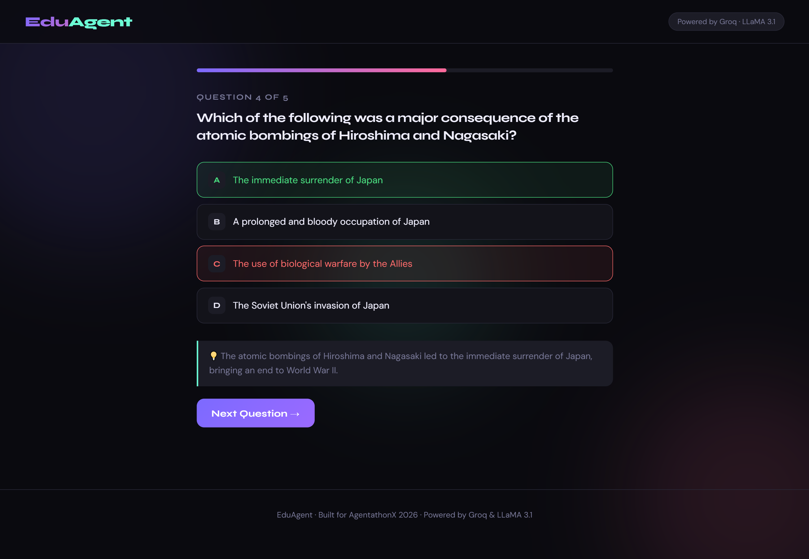
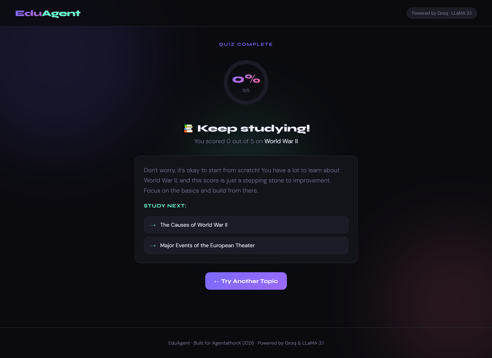

# 🎓 EduAgent — AI-Powered Study Companion

> Built for **AgentathonX 2026** — India's First Online AI Agent Hackathon


## 🌐 Live Demo

Try the deployed app here: https://eduagent-three.vercel.app/

---

## 🚀 What is EduAgent?

**EduAgent** is an intelligent AI study companion that helps students learn any topic faster and smarter. Simply enter a topic, and EduAgent will:

1. 📋 **Generate a personalized 5-step study plan** with key concepts
2. ❓ **Create an adaptive quiz** with 5 MCQs on the topic
3. 🏆 **Evaluate your performance** and recommend what to study next

Whether you're a Class 10 student studying Photosynthesis or a developer learning Python — EduAgent adapts to you.

---

## ✨ Features

- 🤖 **AI-Powered Study Plans** — Structured, topic-specific roadmaps generated in seconds
- 🧠 **Adaptive Quizzes** — 5 MCQs with instant correct/wrong feedback and explanations
- 📊 **Smart Evaluation** — Score analysis with personalized next-topic recommendations
- ⚡ **Lightning Fast** — Powered by Groq's ultra-fast LLaMA 3.1 inference
- 🎨 **Beautiful UI** — Dark theme with smooth animations built in React
- 📱 **Responsive** — Works on desktop and mobile

---

## 🛠️ Tech Stack

| Layer | Technology |
|-------|-----------|
| Frontend | React + Vite |
| Backend | FastAPI (Python) |
| AI Model | LLaMA 3.1 8B via Groq API |
| Styling | Custom CSS with animations |
| Deployment | GitHub Codespaces |

---

## 📁 Project Structure

```
eduagent/
├── backend/
│   ├── main.py          # FastAPI server with CORS
│   ├── agent.py         # AI agent logic (Groq API)
│   └── requirements.txt
├── frontend/
│   └── src/
│       └── App.jsx      # Complete React app
└── README.md
```

---

## ⚙️ How to Run Locally

### Prerequisites
- Python 3.10+
- Node.js 18+
- Groq API Key (free at [console.groq.com](https://console.groq.com))

### Backend Setup
```bash
cd backend
pip install -r requirements.txt
echo "GROQ_API_KEY=your_key_here" > .env
uvicorn main:app --reload --port 8000
```

### Frontend Setup
```bash
cd frontend
npm install
npm run dev
```

Then open `http://localhost:5173` in your browser.

---

## 🤖 How the AI Agent Works

EduAgent uses a **3-stage AI pipeline**:

```
User Input (Topic)
      ↓
[Stage 1] Study Plan Agent
→ Prompt: Generate structured 5-step roadmap
→ Output: JSON with steps, descriptions, key concepts

      ↓
[Stage 2] Quiz Generation Agent  
→ Prompt: Create 5 MCQs with explanations
→ Output: JSON with questions, options, correct answers

      ↓
[Stage 3] Evaluation Agent
→ Prompt: Analyze score, recommend next topics
→ Output: JSON with summary and recommendations
```

All stages use **structured JSON prompting** to ensure consistent, parseable responses.

---

## 🎯 Problem Statement

Students in India struggle with:
- ❌ No personalized study guidance
- ❌ Generic content that doesn't adapt to their level
- ❌ No instant feedback on what they know vs. don't know

**EduAgent solves this** by acting as a 24/7 AI tutor that creates personalized learning experiences for any topic in seconds.

---

## 🏆 Impact

- 🇮🇳 Relevant for 250M+ students in India
- ⏱️ Reduces study planning time from hours to seconds
- 📈 Adaptive feedback helps students focus on weak areas
- 🆓 Completely free to use

---

## 📸 Screenshots

**Home Screen** — Enter any topic to get started


**Study Plan** — 5-step personalized roadmap with key concepts


**Quiz** — Adaptive MCQs with instant feedback and explanations


**Results** — Score analysis with next topic recommendations


---

## 🔮 Future Roadmap

- [ ] Voice input support
- [ ] Multi-language support (Hindi, Tamil, Telugu)
- [ ] Progress tracking across sessions
- [ ] PDF/NCERT textbook upload and study
- [ ] Leaderboard for classroom competitions

## 📄 License

This project is licensed under the MIT License. See [LICENSE](LICENSE) for details.

---

*Made with ❤️ for students across India*
